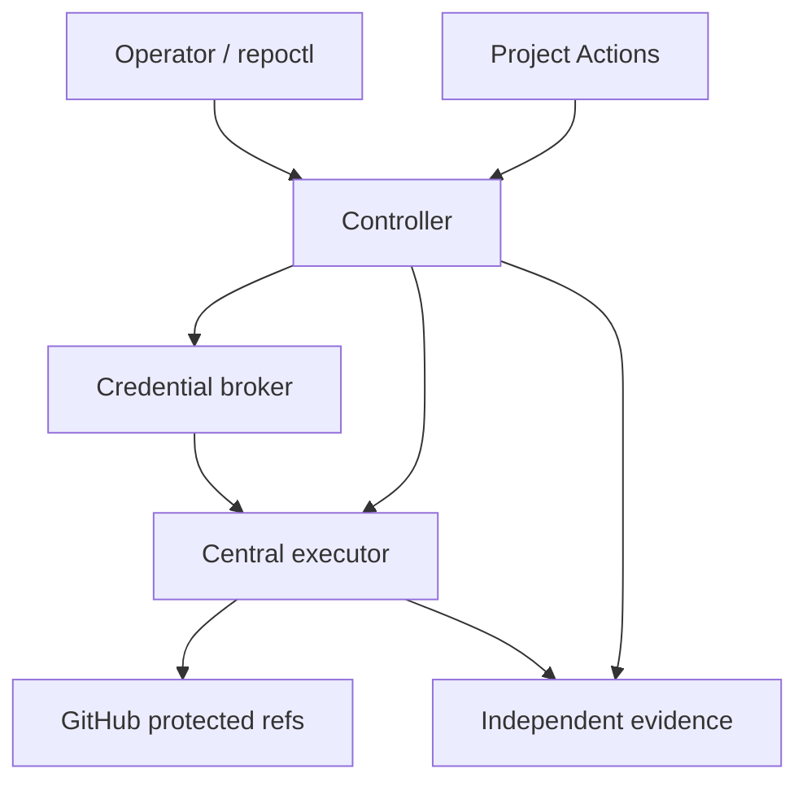

# repoctl: Repository Governance and Delivery Specification

**Status:** Proposed implementation specification

**Owner:** Anthony Vespoli

**Initial target:** `susanbeasles` personal GitHub account

**Scale:** 20–30 active repositories

**Source baseline reviewed:** `susanbeasles/repoctl@24a6e562428809f7b0ee98d53d8a6c6a8e7fc462`

## 1. Purpose

repoctl establishes and maintains a verifiable repository security baseline, preserves protected Git history, and coordinates exact-commit promotion through narrowly authorized automation.

The operator uses one interface to provision repositories, approve policy, submit changes, inspect evidence, and detect drift.

Application validation runs in project-scoped GitHub Actions jobs. Privileged operations execute centrally, outside application-controlled code.

Provisioning, operation, rotation, and recovery must not require the operator to view, copy, paste, download, or manually transport production promotion credentials.

## 2. Required guarantees

| Requirement | Acceptance criterion |
|---|---|
| No local credential exposure | Recording every operator screen and clipboard interaction reveals no promotion credential or reusable promotion authority |
| Exact-SHA promotion | The commit approved and validated is the commit installed on `main` |
| Append-only protected history | Every authorized transition preserves the previous protected tip as an ancestor |
| One-commit promotion | Each normal promotion installs one signed candidate whose sole parent is the expected previous `main` |
| Restricted authority | Project CI cannot obtain promotion credentials or change protected refs |
| Trusted policy | Candidate-controlled configuration cannot weaken the policy authorizing its promotion |
| Independent evidence | Promotion and governance records survive loss or alteration of the GitHub repository |
| Safe interruption | Interrupted operations resume or reconcile without silently weakening controls |
| Repeatable onboarding | Additional repositories use the same implementation and versioned contracts |
| Visible exceptional changes | Policy weakening, identity changes, ref anomalies, and reconciliation failures produce retained evidence and alerts |

These guarantees apply within the documented trust boundaries. They do not claim protection against simultaneous compromise of GitHub administration, controller administration, credential storage, and independent evidence retention.

## 3. Threat model

### 3.1 Threats addressed

- Observation of all local screen content and clipboard contents.
- Malicious or compromised project code.
- Modified workflow callers or forged validation reports.
- Stolen project-scoped CI tokens.
- Unauthorized branch updates, deletion, recreation, and tag mutation.
- Replay of previously valid promotion requests.
- Stale approvals after candidate or policy changes.
- Concurrent promotions.
- Lost, delayed, duplicated, or reordered webhook deliveries.
- Accidental or unauthorized weakening of repository controls.
- Interrupted provisioning, promotion, publishing, or rotation.
- Dependency compromise and prohibited artifact contents.

### 3.2 Trust boundaries

| Boundary | Trusted responsibility |
|---|---|
| Operator hardware signing device | Authorizes policy changes and exact promotion intent |
| GitHub | Hosts repositories, enforces configured rules, reports platform evidence |
| Shared workflow implementation | Runs approved validation and build procedures |
| Controller | Verifies authorization and coordinates state transitions |
| Credential broker | Holds app credentials and issues restricted temporary authority |
| Central executor | Performs approved GitHub mutations |
| Independent evidence storage | Retains records under a separate retention and administration boundary |
| Provisioning/rotation worker | Handles provider credential lifecycle without local exposure |

Hardware MFA protects authentication. Operation-specific signing supplies the separate approval boundary for promotion and policy changes.

### 3.3 Explicit limitations

- Existing authenticated sessions may permit account actions without another hardware MFA challenge.
- GitHub administrators can change repository settings.
- Browser automation depends on provider UI behavior and may encounter interactive authentication.
- Webhooks alone cannot prove complete event coverage.
- A checksum establishes content identity, not safety.
- Attestations are claims whose signer and provenance must be verified.
- A sealed policy does not itself prove that remote settings match it.

## 4. Architecture



### 4.1 Component allocation

| Component | Responsibilities | Prohibited responsibilities |
|---|---|---|
| **repoctl CLI** | Inspect, plan, seal, provision, enroll, submit, approve, verify, reconcile, report | Expose production app credentials |
| **Policy core** | Schema validation, normalization, invariant checks, deterministic decisions | Network access or implicit mutation |
| **`workflow_depot`** | Reusable validation, scanning, build, attestation, publishing, deployment | Hold promotion private keys |
| **Controller** | Request validation, evidence retrieval, approval verification, state coordination, receipts | Execute candidate code |
| **Credential broker** | App JWT signing and installation-token issuance | Accept arbitrary target repositories or arbitrary signing payloads |
| **`delivery_control` executor** | Authorized ref/tag/release operations | Run project scripts or provide a general command shell |
| **Provisioning worker** | Infrastructure deployment, app manifest onboarding, enrollment | Stream secret-bearing runtime output locally |
| **Rotation worker** | Provider key replacement, verification, cutover, retirement | Return private keys to the operator |
| **Evidence service** | Receipt ingestion, checkpoints, retention, reconciliation evidence | Update GitHub branches |
| **Archive service** | Git object/ref preservation and verified recovery | Share archive decryption keys with webhook intake |

### 4.2 Execution decision

V1 uses GitHub Actions for the central promotion executor and Cloudflare for request intake and coordination.

The central executor:

1. Obtains a GitHub OIDC token.
2. Presents it to the controller/broker.
3. Receives authority only for an approved operation.
4. Performs the mutation.
5. Reports the result for independent verification.

The broker checks issuer, audience, expiration, repository identity, workflow identity, trusted revision, and applicable execution context.

A future direct-controller executor may implement the same contract. Policy evaluation and coordination remain shared.

## 5. Repository layout

### 5.1 repoctl source

```text
repoctl/
  Sources/
    repoctl/
    PolicyCore/
    GitHubAdapter/
    OperationContracts/
  controller/
    src/
      intake/
      authorization/
      coordination/
      evidence/
      github/
  provisioning/
  rotation/
  schemas/
  policies/
  tests/
  docs/
```

Physical extraction into separate repositories may follow component maturity. Credential isolation must exist before production use regardless of source layout.

### 5.2 Shared workflow repository

```text
workflow_depot/
  .github/workflows/
    validate.yml
    scan-source.yml
    build.yml
    scan-artifact.yml
    attest.yml
    publish-package.yml
    deploy.yml
    scan-dynamic.yml
  actions/
  schemas/
  docs/
```

### 5.3 Central executor repository

```text
delivery_control/
  .github/workflows/
    promote.yml
    tag.yml
    release.yml
  src/
  tests/
  docs/
```

### 5.4 Project repository

```text
project/
  .github/workflows/
    ci.yml
    handle-promote.yml
    release.yml
    deploy.yml
  .github/policies/
    promotion.json
  .github/CODEOWNERS
  tests/
  <application files>
```

Project callers reference approved shared workflows by full commit SHA.

Repository policy may strengthen central requirements. Relaxations require an explicitly approved, expiring exception.

## 6. Policy model

### 6.1 Policy layers

| Layer | Purpose |
|---|---|
| Account baseline | Universal integrity and authority requirements |
| Workload profile | Applicable controls for service, library, mobile, infrastructure, or tooling |
| Repository policy | Repository-specific requirements |
| Approved exception | Narrow, attributable, time-limited deviation |
| Observed state | Actual GitHub settings and enrolled identities |

Effective policy is evaluated centrally. An input from a candidate branch is never sufficient authority to weaken requirements.

### 6.2 Sealed policy contents

- Schema version.
- Numeric repository and owner identities.
- Authorized app identities.
- Protected refs and managed namespaces.
- Trusted workflow identities and revisions.
- Required validation jobs and evidence types.
- Approval signer enrollment.
- Promotion and release constraints.
- Policy exception records.
- Controller and broker identities.
- Evidence destination and retention requirements.

### 6.3 Seal behavior

V1 uses a defined canonical JSON representation for policy signing and digest generation.

A seal records:

- Policy digest.
- Signer identity.
- Policy revision.
- Previous accepted policy digest.
- Signature algorithm and signature.
- Enrollment reference.

Existing exact-byte seals require explicit migration. Migration must not silently reinterpret an old signature.

Accepted policy state must be retained remotely. Deleting local Keychain enrollment cannot reset the controller’s accepted revision.

### 6.4 Policy updates

Policy updates follow:

1. Produce a concrete diff.
2. Classify security-relevant changes.
3. Obtain hardware-backed authorization.
4. Retain the proposed policy and authorization.
5. Apply changes with a resumable journal.
6. Read back effective configuration.
7. Commit the accepted revision.
8. Publish a receipt.

Unknown or partially applied state blocks affected privileged operations.

## 7. Repository lifecycle

| State | Meaning |
|---|---|
| `discovered` | Repository inspected; unmanaged |
| `planned` | Desired configuration calculated |
| `provisioning` | Journaled setup in progress |
| `enrolled` | Identities, policy, and workflows registered |
| `active` | Verified promotion path and baseline |
| `frozen` | Development/ref mutation restricted |
| `degraded` | Drift, missing evidence, or unresolved operation |
| `retired` | Removed from normal automation with retention preserved |

“Promotion ready” is a verified capability, not an assumption based on app installation.

Existing repositories retain their earlier history. Onboarding does not rebase, squash, or replace historical commits.

Legacy history constraints apply prospectively where necessary; exceptions are recorded explicitly.

## 8. Ruleset model

| Layer | Create | Update | Delete | Bypass |
|---|---|---|---|---|
| Main integrity | Governed separately | Fast-forward and required integrity constraints | Denied | None for routine operation |
| Main mutation authority | Restricted after bootstrap | Promotion app only | Governed by integrity layer | Promotion app for update restriction |
| Working namespaces | Authorized developer | Authorized developer | Lifecycle policy | Explicit developer authority |
| Snapshot refs | Integration controller | Denied | Only after required preservation | Integration identity for applicable lifecycle rules |
| Integration refs | Integration controller | Denied | Only after required preservation | Integration identity for applicable lifecycle rules |
| Frozen retained refs | Denied | Denied | Denied | None |
| Tag immutability | Governed separately | Denied | Denied | None |
| Tag creation | Release identity | Governed by immutability | Governed by immutability | Release identity for creation restriction |

Important invariants:

- An app’s update bypass does not bypass deletion or force-update restrictions.
- Unrelated and inherited rules are inspected and preserved.
- Conflicting effective rules cause a blocking plan result.
- Bootstrap creation is explicit and recorded.
- Frozen refs retain recorded tips.
- Cleanup never deletes preserved refs merely because a workflow completed.

Native required-PR rules and direct exact-SHA fast-forward compatibility must be demonstrated in a disposable repository. If incompatible, the system uses the explicitly specified controller approval gate rather than silently granting a broad bypass.

## 9. Promotion protocol

### 9.1 Candidate construction

For submitted source commit `P` and current protected tip `M`:

1. Preserve `P` in an immutable submission snapshot.
2. Apply the submitted change onto `M` in an isolated candidate builder.
3. Produce candidate `S` with exactly one parent, `M`.
4. Sign `S` through the designated candidate-signing identity.
5. Create a fresh immutable integration generation at `S`.

Conflict resolution requires a new reviewed submission or candidate generation.

The candidate signer is separate from the promotion app. Application code receives neither identity’s private key.

### 9.2 Validation

Project Actions validates exact `S` through the approved shared workflow.

Required evidence includes:

- Repository identity.
- Candidate SHA.
- Workflow identity and revision.
- Run ID and attempt.
- Required job conclusions.
- Scanner results and applicable policy.
- Policy digest.
- Artifact identities where applicable.

Missing, skipped, cancelled, or timed-out required jobs do not count as successful validation.

### 9.3 Operator authorization

The CLI displays a sanitized approval summary and requests a hardware-backed signature over:

```json
{
  "schema_version": 1,
  "operation": "promote",
  "repository_id": 1404914851,
  "target_ref": "refs/heads/main",
  "source_sha": "<P>",
  "expected_main_sha": "<M>",
  "candidate_sha": "<S>",
  "candidate_tree_sha": "<tree>",
  "policy_digest": "sha256:<policy>",
  "evidence_digest": "sha256:<evidence>",
  "request_id": "<unique>",
  "nonce": "<unique>",
  "expires_at": "<timestamp>"
}
```

The signature authorizes only that operation.

A GitHub PR approval may be required as additional evidence. V1 production promotion also requires the enrolled operation-specific signature.

### 9.4 Central verification

The controller independently retrieves evidence and verifies:

- Repository enrollment and owner identity.
- Trusted validator execution path.
- Exact candidate and policy.
- Required jobs and approvals.
- Candidate signature.
- Sole parent `M`.
- Current main remains `M`.
- No drift affecting authorization.
- Authorization freshness and replay status.

### 9.5 Execution

1. Acquire a durable operation lease.
2. Retain an authorized intent receipt.
3. Dispatch the trusted central executor.
4. Verify executor OIDC identity.
5. Issue target-restricted temporary authority.
6. Recheck GitHub state.
7. Update main to `S` without force.
8. Read back main.
9. Retain a completion receipt.
10. Create and verify preservation tags.
11. Perform authorized cleanup.

GitHub’s ref API does not provide an expected-old-SHA comparison. The protocol therefore requires serialized exclusive promotion authority and state rechecks. Other paths using the same app identity are prohibited.

### 9.6 Interrupted execution

If the network fails after an update request:

- Read the protected ref before retrying.
- If it equals `S`, reconcile completion.
- If it equals `M`, determine whether retry remains authorized.
- Otherwise mark the operation degraded and investigate.

Never blindly repeat a write.

## 10. Credential provisioning

### 10.1 Operator experience

Proposed interface:

```sh
repoctl controller provision
repoctl app enroll
repoctl repo enroll susanbeasles/project-a
repoctl repo plan susanbeasles/project-a
repoctl repo apply susanbeasles/project-a
repoctl repo verify susanbeasles/project-a
```

These are target commands, not claims about the current CLI.

The operator signs in and approves provider permissions. Secret material remains inside remote provisioning infrastructure.

### 10.2 App onboarding

1. Provision callback infrastructure.
2. Generate the least-privilege GitHub App manifest.
3. Present GitHub’s registration approval.
4. Validate callback state and expiration.
5. Exchange the code server-side.
6. Transfer generated credentials directly to protected storage.
7. Configure webhook verification.
8. Authorize selected installations.
9. Verify app permissions and repository scope.
10. Retain a sanitized enrollment receipt.

The production promotion app has no repository-administration permission.

### 10.3 Credential exposure restrictions

Private keys and bearer tokens must never appear in:

- Local terminal output.
- Clipboard contents.
- Browser previews.
- Workflow artifacts.
- Screenshots or recordings.
- Debug traces.
- Error responses.
- Provisioning receipts.
- Committed configuration.

Callback codes and authentication sessions receive equivalent protection where they provide reusable authority.

## 11. Credential rotation

### 11.1 Shared lifecycle

```text
requested
→ staged
→ verified
→ activated
→ observed healthy
→ previous credential retired
→ completed
```

Each transition is journaled.

Failure preserves the last known working credential unless compromise response explicitly requires immediate revocation.

### 11.2 GitHub App key rotation

Because documented public API key rotation is unavailable, V1 includes an isolated browser adapter.

The worker:

- Uses an authorized, narrowly scoped administrative identity.
- Captures the replacement download remotely.
- Imports it directly into protected credential storage.
- Verifies app authentication and token issuance.
- Switches the broker.
- Deletes the previous provider key after verification.
- Destroys temporary storage and the worker.

No secret-bearing browser stream reaches the operator.

Provider MFA or challenges may require operator approval. The system does not bypass them.

Browser failure, session expiry, or uncertain provider state stops rotation and triggers reconciliation.

### 11.3 Other credentials

- Installation tokens are minted on demand.
- OIDC removes stored executor login secrets.
- Webhook-secret replacement uses a verified cutover protocol.
- Evidence-signing and candidate-signing identities have separate rotation histories.
- Existing signatures remain verifiable after signer retirement.

## 12. Validation and delivery controls

| Control | Placement | Default behavior |
|---|---|---|
| Lint, types, tests | Project reusable workflow | Required by workload profile |
| SAST | Project scan job | Gate policy-defined findings |
| SCA | Project scan and scheduled rescan | Gate prohibited vulnerabilities |
| Secrets scanning | GitHub controls plus supplemental scanning | Prevent leaks; revoke exposed credentials |
| Workflow/IaC scanning | Project scan job | Gate prohibited configurations |
| Malware scanning | Isolated dependency/artifact scan | Quarantine detections; no absolute safety claim |
| SBOM | Final build | Bind inventory to artifact digest |
| IAST | Instrumented QA | Applicable-profile requirement |
| Fuzzing | Short gate and scheduled deep runs | Preserve reproducible failures |
| DAST | Test/staging environment | Bounded gate plus scheduled deep scan |
| RASP | Runtime platform | Workload-specific adoption and measurement |
| OWASP verification | Policy and engineering evidence | ASVS/WSTG requirements |
| Artifact provenance | Trusted build workflow | Verify builder identity and artifact digest |
| Package publishing | Isolated project publisher | Scoped registry identity |
| Deployment | Environment-scoped job | Consume verified artifact by digest |

Scanner profiles distinguish applicable, required, optional, and unavailable controls.

Required scanner unavailability cannot silently become success.

Exceptions record owner, rationale, scope, expiration, and approval.

## 13. Release and artifact contract

A release binds:

- Promoted source SHA.
- Version.
- Final artifact digests.
- SBOM digests.
- Build provenance.
- Required scan evidence.
- Signing identity.
- Policy digest.
- Publication destinations.

Build once and publish the same package bytes where registry formats permit.

Signing or packaging that changes bytes generates a new final digest and an explicit relationship to the prior artifact.

Publishing to multiple registries is independently journaled. A partial publication is reconciled without rebuilding under the same version.

Protected tags are created once. Existing tags cannot move or disappear through normal release automation.

Deployment verifies source, digest, signer, and expected builder—not merely the presence of a signature.

## 14. Evidence and history preservation

### 14.1 Receipt contents

- Schema and policy versions.
- Repository and operation identities.
- Sequence and previous receipt digest.
- Request and authorization digests.
- Previous and resulting refs.
- Validation run and attempt.
- Approval identities.
- Executor identity.
- Credential fingerprint or public key identifier.
- Outcome and reconciliation state.
- Signature and retention acknowledgment.

No secret material enters receipts.

### 14.2 Evidence storage

Use a dedicated receipt bucket and restricted ingestion service.

Archive storage is separate. Webhook intake receives neither archive decryption keys nor broad archive-management credentials.

Retention controls and administration boundaries must be verified during provisioning.

Hash chaining supports continuity checks. Independently retained signed checkpoints establish reference points against which deletion or rewriting can be detected.

### 14.3 Event coverage

Combine:

- Authenticated webhooks.
- Scheduled ref/settings reconciliation.
- Controller operation journals.
- Available provider audit records.
- Independent checkpoints.

Webhooks are notifications, not a complete authoritative history.

### 14.4 Git recovery

Receipts do not replace Git backups.

The archive interface covers refs, available objects, and restoration metadata. FlareKit integration remains a separate milestone and must not block baseline or promotion delivery.

Snapshot/integration cleanup requires verified preservation of their reachable commit graphs under the configured retention policy.

## 15. Modular contracts

| Contract | Input | Output |
|---|---|---|
| Policy compiler | Policy and capabilities | Desired configuration |
| Planner | Desired and observed state | Change plan |
| Evidence verifier | Evidence references and policy | Verified evidence result |
| Authorizer | Request, evidence, signature, observed state | Decision |
| Executor | Bound authorization | Execution result |
| Reconciler | Journal and observed state | Resolution or blocking incident |
| Receipt writer | Operation record | Signed retained receipt |
| Credential adapter | Authorized lifecycle operation | Public status and credential reference |

Core functions are deterministic where possible.

Adapters own provider APIs, storage, browsers, and credential access.

CLI, controller, and executor share versioned schemas and conformance fixtures.

## 16. Operational behavior

- Every mutation has a unique operation ID.
- Every multi-step mutation has a resumable journal.
- Unknown state blocks relevant privileged operations.
- Temporary credentials are never persisted to artifacts or Git configuration.
- Controller and executor dependencies are pinned and reviewed.
- Sensitive jobs use fresh isolated execution environments.
- No application dependency installation occurs in privileged executor jobs.
- Policy/control changes require separate review from application changes.
- Emergency actions retain evidence and never masquerade as ordinary promotion.
- No automatic fallback silently grants a broader identity.

## 17. Required tests

| Test | Expected result |
|---|---|
| Local screen and clipboard recording during provisioning/rotation | No credentials or reusable authority exposed |
| Failed or skipped required job | Promotion rejected |
| Forged check with expected name | Rejected by provenance verification |
| Modified candidate workflow/policy | Cannot weaken trusted authorization |
| Approval for another SHA/repository | Rejected |
| Expired or replayed authorization | Rejected |
| Main advances after validation | New candidate and approval required |
| Two concurrent requests | Serialized; stale request rejected |
| Human main update | Rejected |
| Promoter force update or main deletion | Rejected |
| Existing tag update/delete | Rejected |
| Webhook forgery or delivery collision | Rejected |
| Missing webhook | Reconciliation detects discrepancy |
| Interrupted ref update | Read-back resolves outcome before retry |
| Rotation interruption | Working credential preserved or explicit incident recorded |
| Wrong artifact digest/builder | Publication or deployment rejected |
| Ruleset drift | Affected promotion blocked and alert retained |
| Deleted local policy enrollment | Cannot reset remote accepted policy |
| Receipt deletion or rewriting | Checkpoint/continuity verification detects inconsistency |
| Frozen ref mutation | Rejected and observed |
| Partial registry publication | Resume remaining destination without rebuilding |

Tests must verify effective GitHub behavior in disposable repositories. Configuration read-back alone is insufficient.

## 18. Delivery milestones

| Milestone | Deliverable | Exit condition |
|---|---|---|
| **M0 — Baseline reconciliation** | Source audit, shared schemas, split rulesets, current documentation | Existing behavior understood; no misleading readiness claims |
| **M1 — Automated provisioning** | Manifest onboarding, credential ingestion, infrastructure enrollment | Operator never handles app secrets |
| **M2 — One complete promotion** | Candidate, validation, signed approval, executor, receipts | Positive and adversarial promotion tests pass |
| **M3 — Reusable enrollment** | Thin callers, workload profiles, pinned updates | Multiple repositories onboard through the same path |
| **M4 — Rotation and lifecycle** | Isolated browser adapter, verification, retirement | Rotation completes without local credential exposure |
| **M5 — Release and publishing** | Tags, signed artifacts, provenance, registries | Exact artifact identity preserved across destinations |
| **M6 — Expanded security controls** | Applicable scanners, runtime integration, exception management | Coverage and failure behavior verified per profile |
| **M7 — Recovery integration** | Archive adapter and restore verification | Independent Git recovery demonstrated |

## 19. Current implementation assessment

At the reviewed source baseline:

- Swift policy sealing and repository bootstrap commands exist.
- Controller webhook authentication and repository coordination foundations exist.
- Event receipt storage exists.
- Promotion remains disabled.
- Current provisioning documentation requires manual webhook-secret handling.
- Fixed bootstrap commands do not consume sealed customizable policy.
- Full promotion, credential brokerage, automated app onboarding, and rotation remain unimplemented.
- Existing documentation contains bootstrap behavior that must be reconciled with the intended Actions-enabled delivery path.

The implementation should retain useful existing components and replace manual credential provisioning with the lifecycle defined here.

## 20. Production readiness

repoctl is production-ready for a repository only when:

1. Effective rules have passed behavioral tests.
2. Provisioning and rotation expose no local promotion credentials.
3. Exact-SHA authorization cannot be forged by project-controlled code.
4. The tested and approved candidate is promoted unchanged.
5. Protected history and tags reject unauthorized destructive operations.
6. Interrupted operations reconcile deterministically.
7. Drift and missing evidence fail closed.
8. Receipts are retained and verified independently.
9. Recovery limitations are visible and accurately reported.
10. The operator can repeat enrollment without rebuilding the mechanism.
